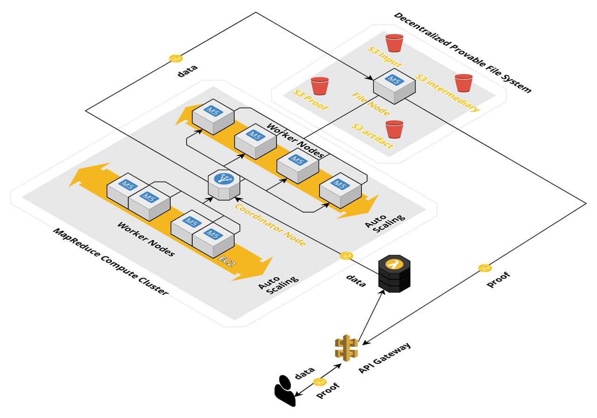

# Introduce Paralleliztion and Memory Sharding to Cairo

---

This repository is the final submission from the [STARKScale](https://starkscale.vercel.app/) team for the Starknet Hacker House at ETHDenver 2024. It contains both the repository of the zk-hadoop and recursive verifiers that were completed in the time frame of the hackathon! 

# Project Overview
Our project pioneers large-scale zero-knowledge (ZK) computations by merging distributed systems with Incrementally Verifiable Computation (IVC). We address the scalability bottleneck inherent in sequential ZK languages by introducing parallelization and memory sharding, thereby distributing large datasets across multiple nodes.

# Cairo1 End to End zk-Hadoop

* Parallelization: We overcome the sequential limitations of traditional ZK languages by enabling concurrent computation.
* Memory Sharding: By partitioning data across various nodes, we efficiently manage and process large datasets.
* zk-Hadoop MapReduce: Our system employs a zk-Hadoop map-reduce approach for matrix-vector multiplication. 
* Users input data via input.json, which is then divided and processed by mapper and reducer nodes orchestrated by a coordinator node.
* Go Worker Nodes: The worker nodes, implemented as Go servers, execute Cairo code, interacting with rust provers and verifiers to compute tasks and generate proofs based on the computation trace.

# Cairo0 Recursive Verifier

A cornerstone of our project is the recursive verifier, inspired by the SHARP prover, operating under a recursive layout. This innovative approach allows us to:
* Run Cairo code in a recursive layout.
* Use the Cairo0 verifier to validate proofs generated by the Stone prover, and subsequently, integrate these proofs into a single, verifiable proof through the computation trace.
Iteratively apply the recursive verifier to reduce multiple proofs down to a singular, comprehensive proof.

# Current Limitations 
While our project successfully demonstrates the potential of integrating distributed systems with IVC for ZK computations, we acknowledge the current limitation in recursively verifying Cairo1 proofs. As a proof of concept, we have developed the system using Cairo0. Future updates will include transitioning to a Cairo1 recursive proof system, contingent on StarkNet releasing a Cairo1 verifier.

## Integration with Amazon Web Services (AWS)
Our initial implementation showcases the potential of combining zero-knowledge computations with distributed systems on a single-node setup. To truly harness the power of distributed computing and enhance scalability, reliability, and performance, we plan to expand our architecture to integrate seamlessly with Amazon Web Services (AWS).

## Contributors
Felix Meng, Tommy Hang, Trevor Trinh, Liwen Ouyang

Incredbile thanks to our mentors, guides, and friends:
- David
- Pierre
- Ivan
- Marcelo
- Gnana
- Gurk
- Beja

